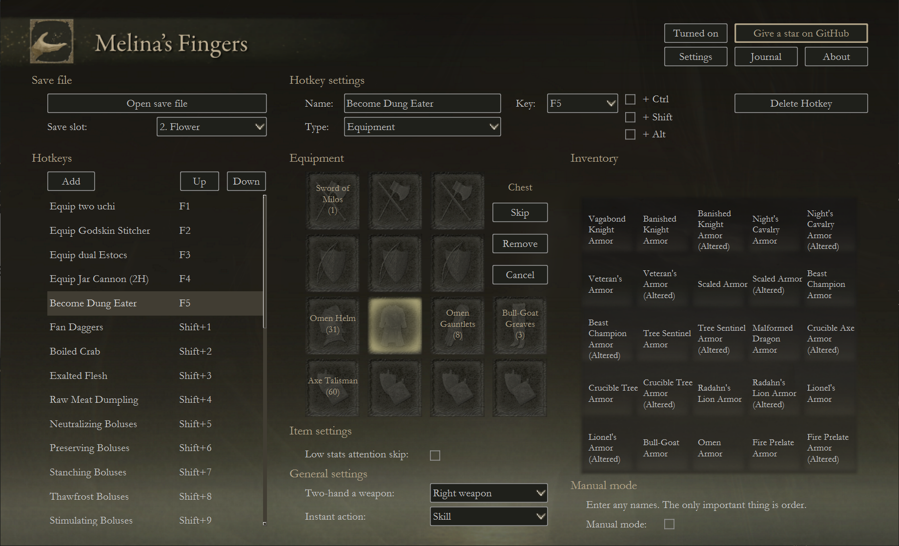
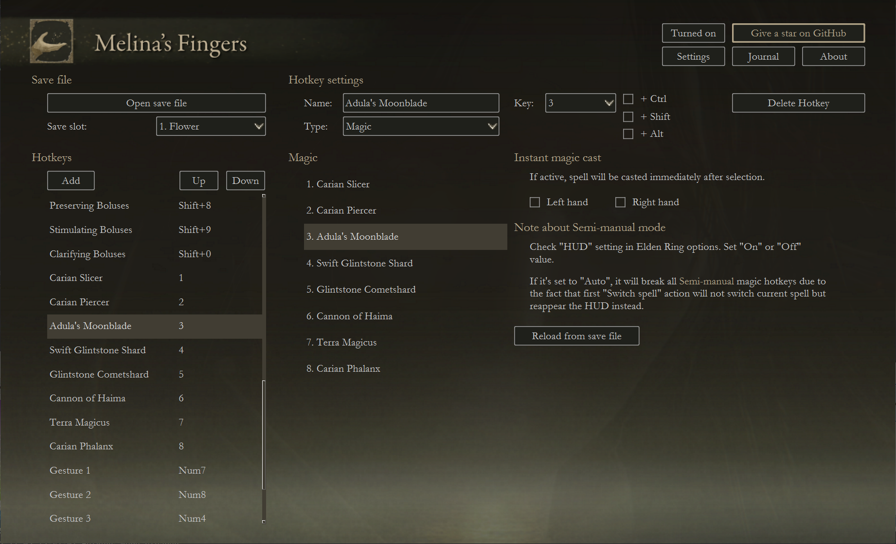

  

<h3 align="center">Melina's Fingers</h3>

Hotkey tool to improve your Elden Ring experience.

<a href="https://www.nexusmods.com/eldenring/mods/2494">Nexus page</a>

  

  

  

## Features
Melina's Fingers has several types of hotkeys to customize:
- **Equipment:** hotkeys for armaments, armor and talismans;
- **Magic:** hotkeys for current magic list;
- **Items:** hotkeys for items in your quick items list;
- **Built-in:** some useful hardcoded hotkeys;
- **DIY:** rich hotkey designer, so you can come up with almost any hotkey you want. You can send me your best DIY-scripts, and I'll add them to "Built-in" hotkeys with author's name.

With Melina's Fingers help you can bind to hotkey different game actions, such as:
- **weapons equipment:** change your current weapon in about a second, and instantly take it in two hands or perform a skill if you need it;    
- **armor equipment;**  
- **talismans equipment;**  
- **changing all equipment at once:** change all your current weapons, armor and talismans in 7-10 seconds;
- **magic select:** now you don't have to calculate how many times you have to press "Switch spell" button to get to needed spell in the heat of battle;
- **quick item select:** now you don't have to calculate how many times you have to press "Switch item" button to get to needed item in the heat of battle;
- **crouch attack;**
- **stance attack;**
- **reverse backstep;**
- **fast katana stance attacks:** these stance attacks makes recovery animation much shorter;
- **several invasion attempts in a row:** now you don't have to constantly use Bloody Finger, then Recusant Finger and then again, waiting for invasion to get started; 
- **gestures**

and many more.

For "Equipment", "Magic" and "Item" types of hotkeys there are two search modes:
- **Auto:** slower but more stable;
- **Semi-manual:** faster but less stable and you'll need to press "Recovery key" if something went wrong (press "Settings" button for more information).

And of course, Melina's Fingers is **totally safe online** as it doesn't change anything in your game. It just reads your safe file once to give you information about your controls, equipment, magic and items.  

## Getting Started
1. [Download latest Melina's Fingers release](https://github.com/flower-ab/EldenRing-MelinasFingers/releases/latest);
2. Put .exe file to separate folder (as next to it will be created an additional ".cfg" file);
3. As you launch Melina's Fingers, it will try to get your save file from standard path. But if something went wrong, choose save file manually with "Open save file" button; 
4. Go to "Settings" and make sure that all your Elden Ring controls are filled. If it's not, then go to Elden Ring and assign every action to any keyboard button, then press "Reload from save file" button or fill controls manually;
5. Adjust font size and window scale, so it would be comfortable;
6. There's already some introductory hotkeys on the left. You can use these, or add your own hotkeys;
7. If you use "Equipment" hotkey, make sure that your list is sorted by "Order of Acquisition", ascended. There's a special "Built-in" hotkey to sort all your lists by that rule.

Anyway, I recommend to watch the tutorial:

ССЫЛКА НА ТУТОРИАЛ

## Some little important things

### Put everything you don't need in a chest.
If you have a big inventory, then virtual key press sequences will be long and unstable. Melina's Fingers works great on lists with less than 50 items. I actually don't think you need more. 

### There's still problems with collecting weapons and armor from save file.
Unfortunately, it's very likely that you'll have to use "Manual mode" in "Equipment" hotkeys as weapons and armor can be stored in save file according to very complex rules. 
Sometimes Melina's Fingers can read it from save file. But sometimes not, especially if you have many items.

### Not every hotkey bindings will work
Some bindings would call OS commands so be careful with bindings with specific keys. E.g. don't bind your hotkeys to "Alt+F4" :)

### Don't use too short profile name
There are can be problems to collect your equipment information from save file if your character in named "F", "a", '.' and so on.

### I would really appreciate if you'll give this repo a star
Your star to Melina's Fingers repo is everything I need in my life. 

I live in Russia, and I want to get a job as Python developer. And it's going to be really difficult due some recent events in my country, as nobody need juniors in hard times. But a repo with some stars would greatly help me with my first job search.
