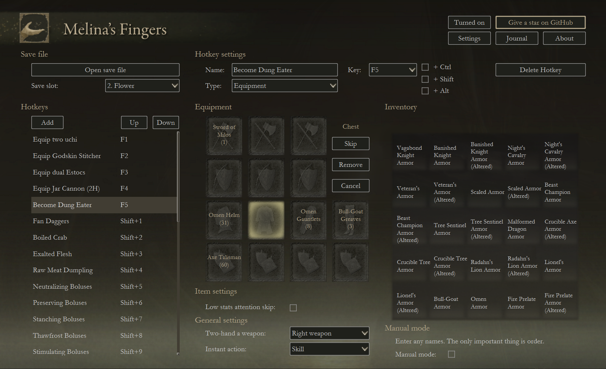
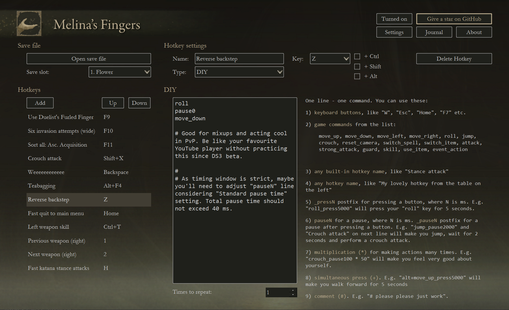

_It was made pretty long time ago for fun and learning PyQt<br>
(also for getting free PyCharm Pro license_ 😎).<br>
_Code of this project no longer indicates my current skills.<br> 
Repository is left public for the sake of Elden Ring community._

<br>
<br>

<p align="center">
  <a target="blank"></a>
</p>

<h3 align="center">Melina's Fingers</h3>
<p align="center">Hotkey tool to improve your Elden Ring experience. Melina's Fingers aims to bring you joy by freeing you from UI limitations that we had to endure since Demon’s Souls (2009).</p>
<p align="center">New version will come right together with new Elden Ring DLC!</p>
<p align="center"><a href="https://www.nexusmods.com/eldenring/mods/2504">Nexus page</a></p>

<p align="center">
  <a target="blank"></a>
</p>
<p align="center">
  <a target="blank"></a>
</p>
<p align="center">
  <a target="blank"></a>
</p>

### Features
Melina's Fingers lets you bind game actions to hotkeys, making your gameplay much more fluid and pleasant as actions that required pressing >10 buttons now require pressing only one. 

With Melina's Fingers you can additionally bind almost anything:
- **weapons hardswap**: change your current weapon in about a second, and instantly take it in two hands or perform a skill if you need it;
- **armor hardswap**;
- **talismans hardswap**;
- **changing all equipment at once**: hardswap your whole _build_ in 5-7 seconds, well that's something new;
- **selecting next/previous weapon**;
- **magic select**: Melina's Fingers brings a joy of playing the mage to the new level as you can handle your spells much, much easier and faster;
- **quick item select**: now you don't have to calculate how many times you have to press "Switch item" button to get to needed item in the heat of battle;
- **gestures**: now you need only 1 button to perform a gesture;
- **invasion attempts in a row**: you press 1 button, and Meilna's fingers uses Bloody Finger, then Recusant Finger and so several times. It will get you to invasion much - faster than just waiting for invasion or constantly using Bloody and Recusant Finger yourself;
- **using Duelist's or Tarnished's Furled Fingers**;
- **two-handing a weapon**: if you still miss good ol' days when it could be done with one button; 
- **fast quit to main menu**: useful if you lost to gravity but still want to cheat death;
- **crouch attack**;
- **stance attack**;
- **reverse backstep**;
- **fast katana stance attacks**: these stance attacks makes recovery animation much shorter due performing a crouch after each attack;

and any crazy hotkey you made yourself via **rich DIY-constructor**. You can even make a hotkey for farming mobs being AFK.

### Getting Started
1. [Download latest Melina's Fingers release](https://github.com/flower-ab/EldenRing-MelinasFingers/releases/latest);
2. Put .exe file to separate folder (as next to it will be created an additional .cfg file);
3. As you launch Melina's Fingers, it will try to get your save file from standard path. But if something went wrong, choose save file manually with "Open save file" button; 
4. Go to "Settings" and make sure that all your Elden Ring controls are filled. If it's not, then go to Elden Ring and assign every action to any keyboard button, then press "Reload from save file" button or fill controls manually;
5. Adjust font size and window scale, so it would be comfortable;
6. Set "Standard pause time" according to your FPS in Elden Ring;
7. There's already some introductory hotkeys on the left. You can use these, or add your own hotkeys. By the way, there're 10 item hotkeys and 10 magic introductory hotkeys with "Built-in" type. If you'll turn them to "Magic" and "Item" types and then set "Items search mode" and "Magic search mode" to "Semi-manual", you'll see some nice difference in hotkey speed.;
8. If you use "Equipment" hotkey, make sure that your list is sorted by "Order of Acquisition", ascended. There's a special "Built-in" hotkey to sort all your lists by that rule.

Basically what Melina's Fingers does:
- reads your controls, equipment, magic and items from your safe file;
- uses this information so it would be easier for you to set your hotkeys via GUI;
- if you press a hotkey during gameplay, it turns your settings into a sequence of virtual keyboard presses and performs it fast. 

Melina's Fingers has several types of hotkeys to customize:
- **Equipment**: hotkeys for armaments, armor and talismans;
- **Magic**: hotkeys for current magic list;
- **Items**: hotkeys for items in your quick items list;
- **Built-in**: some useful hardcoded hotkeys;
- **DIY**: rich hotkey designer, so you can come up with almost any hotkey you want. You can send me your best DIY-scripts, and I'll add them to "Built-in" hotkeys with author's name in future versions.

For "Equipment", "Magic" and "Item" types of hotkeys there are also two search modes:
- **Auto**: slower but more stable;
- **Semi-manual**: faster but less stable and you'll need to press "Recovery key" if something went wrong (press "Settings" button for more information).

### Some little important things

#### Put everything you don't need in the chest
If you have a big inventory, then virtual key press sequences will be long and unstable. Melina's Fingers works great on lists with less than 50 items. I actually don't think you need more. 

#### There's still problems with collecting weapons and armor from save file
Unfortunately, it's very likely that you'll have to use "Manual mode" in "Equipment" hotkeys as weapons and armor can be stored in save file according to very complex rules. 
Sometimes Melina's Fingers can read it from save file. But sometimes not, especially if you have many items.

#### Not every hotkey bindings will work
Some bindings would call OS commands so be careful with bindings with specific keys. E.g. don't bind your hotkeys to "Ctrl+Alt+Delete" :)

#### Don't use too short profile name
There are can be problems to collect your equipment information from save file if your character in named "F", "a", "." and so on.

#### The only way to interrupt a sequence is to Alt+Tab to another application
There're no long sequences, but you can make something really long in DIY hotkey type. If you did so, just Alt+Tab from Elden Ring, it will break the sequence.

# Developing

### First run

1. Clone the repo.
   ```sh
   $ git clone git@github.com:a-burlakov/melinas-fingers.git
   ```
2. Install dependencies:
   ```sh
   cd melinas-fingers  # if needed
   pip install -r requirements.txt 
   ```
3. Run ```src/main.py```.

### UI development

1. Install [Qt Designer](https://build-system.fman.io/qt-designer-download) for interactive UI development.
2. Open ```src/utils/mainWindow.ui``` via Qt Designer.
3. Make your changes.
4. Run ```src/utils/qtdesigner_to_py.bat```. That will create corresponding .py files (`mainWindow.py` and `ui_rc.py`).

### Freezing to .exe

1. Just use PyInstaller:
```sh
pyinstaller src\main.py -F -w -i src\utils\ui_img\icon.ico  
```

2. Newly created ```dist``` folder will have your .exe file.
